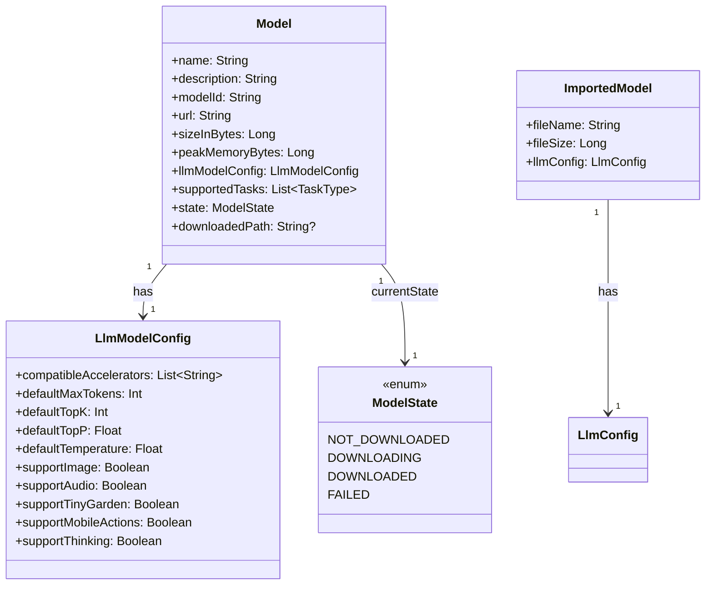
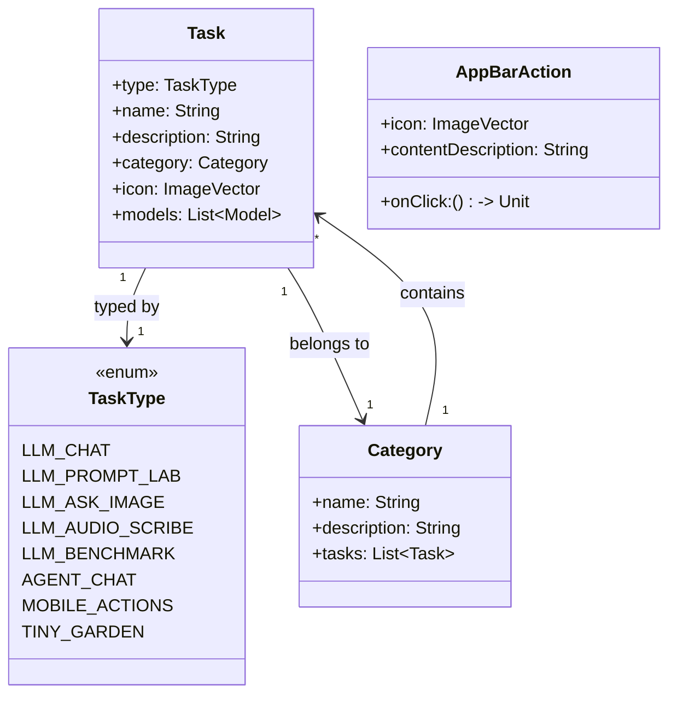
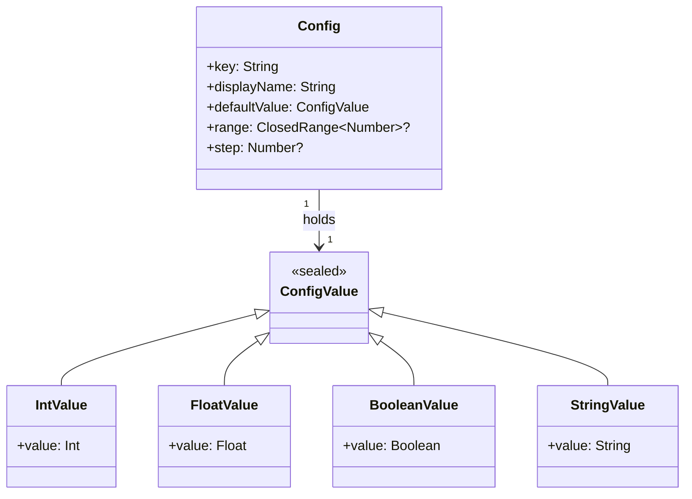
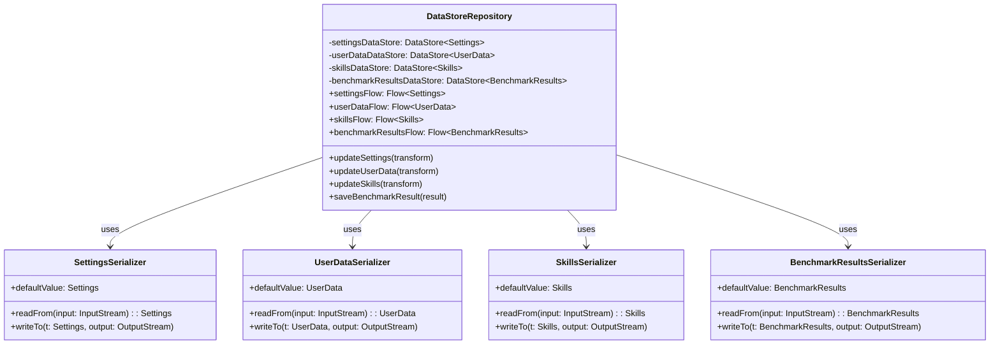
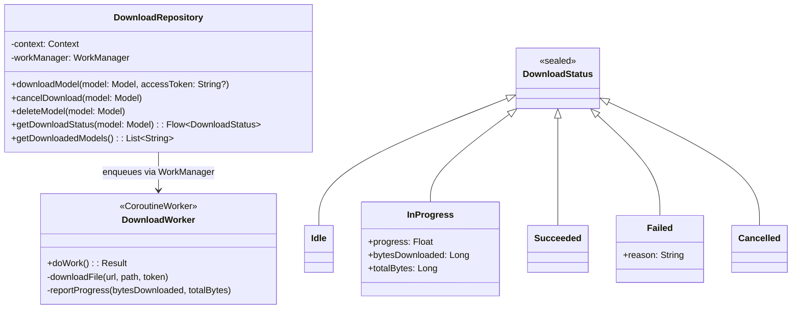
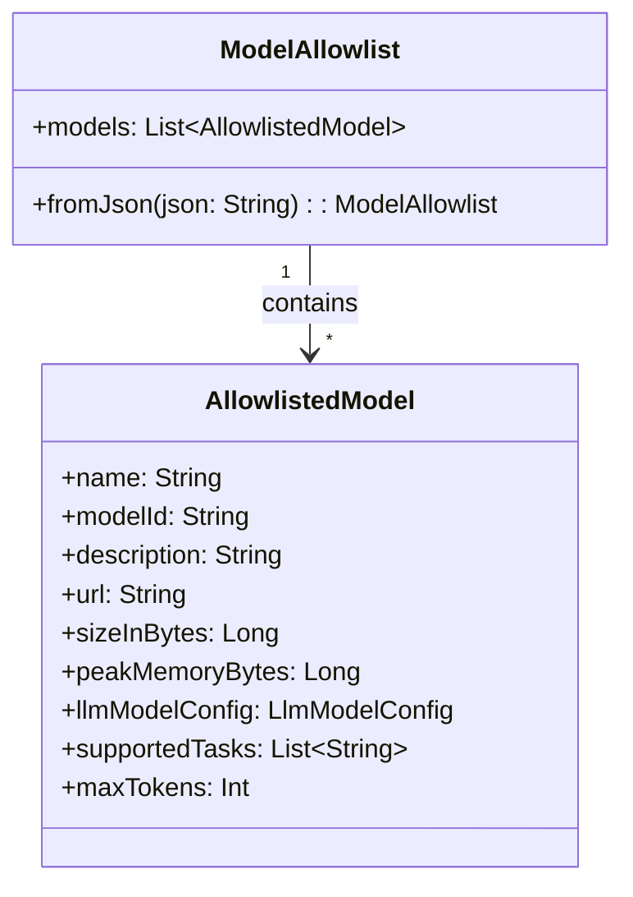
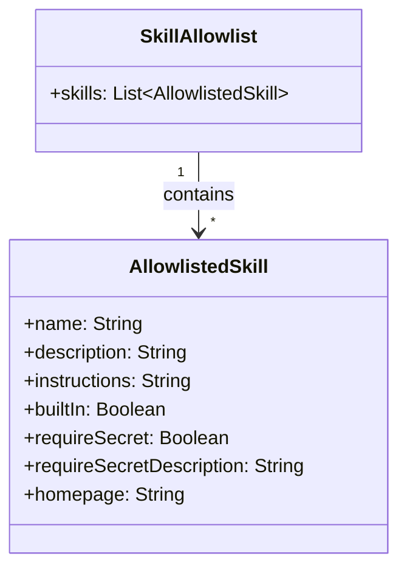

# L4 Architecture — Data Layer

> **C4 Model Level 4 — Data Layer:** Classes responsible for data modeling, persistence, and repository operations.

---

## Overview

The data layer is split into two sub-layers:

1. **Domain models** (`data/`) — pure Kotlin data classes and enumerations describing business entities.
2. **Persistence** — Jetpack DataStore backed by Protocol Buffer serializers.

```
data/
├── Model.kt            ← LLM model descriptor
├── Tasks.kt            ← Task registry
├── Categories.kt       ← Task category definitions
├── Config.kt           ← App-wide configuration object
├── ConfigValue.kt      ← Typed configuration value wrapper
├── Consts.kt           ← String/numeric constants
├── Types.kt            ← Shared enums (DownloadStatus, TaskType…)
├── AppBarAction.kt     ← Action items for the top app bar
├── DataStoreRepository.kt  ← Single source of truth for persisted data
├── DownloadRepository.kt   ← Model download management
├── ModelAllowlist.kt   ← Allowlist of models the app supports
└── SkillAllowlist.kt   ← Allowlist of skills the app ships with
```

---

## Class Diagrams

### Core Data Models



### Task and Category Models



### Configuration Models



---

## Protocol Buffer Schemas

All persisted state uses Proto3 serialized via Jetpack DataStore.

### Settings Proto

```proto
message Settings {
  Theme theme = 1;                          // LIGHT / DARK / AUTO
  repeated string text_input_history = 3;   // recent prompts
  repeated ImportedModel imported_model = 4;// user-imported .task files
  bool is_tos_accepted = 5;
  bool has_run_tiny_garden = 6;
  bool has_seen_benchmark_comparison_help = 7;
  bool is_gemma_terms_accepted = 8;
  map<string, bool> feature_flags = 9;
  repeated string viewed_promo_id = 10;
}

message ImportedModel {
  string file_name = 1;
  int64 file_size = 2;
  LlmConfig llm_config = 3;
}

message LlmConfig {
  repeated string compatible_accelerators = 1;
  int32 default_max_tokens = 2;
  int32 default_topk = 3;
  float default_topp = 4;
  float default_temperature = 5;
  bool support_image = 6;
  bool support_audio = 7;
  bool support_tiny_garden = 8;
  bool support_mobile_actions = 9;
  bool support_thinking = 10;
}
```

### UserData Proto

```proto
message UserData {
  AccessTokenData access_token_data = 1; // OAuth tokens
  map<string, string> secrets = 2;       // skill API keys
}

message AccessTokenData {
  string access_token = 1;
  string refresh_token = 2;
  int64 expires_at_ms = 3;
}
```

### Skills Proto

```proto
message Skills {
  repeated Skill skill = 1;
}

message Skill {
  string name = 1;
  string description = 2;
  string instructions = 3;
  bool built_in = 4;
  string skill_url = 5;
  string import_dir_name = 6;
  bool selected = 7;
  bool require_secret = 8;
  string require_secret_description = 10;
  string homepage = 9;
}
```

### BenchmarkResults Proto

```proto
message BenchmarkResults {
  repeated BenchmarkResult result = 1;
}
message LlmBenchmarkBasicInfo {
  string model_name = 3;
  string accelerator = 4;
  int32 prefill_tokens = 5;
  int32 decode_tokens = 6;
  int32 number_of_runs = 7;
  string app_version = 8;
}
message LlmBenchmarkStats {
  ValueSeries prefill_speed = 1;          // tokens/sec
  ValueSeries decode_speed = 2;           // tokens/sec
  ValueSeries time_to_first_token = 3;    // seconds
  double first_init_time_ms = 4;
}
message ValueSeries {
  double min = 2;
  double max = 3;
  double avg = 4;
  double medium = 5;
  double pct25 = 7;
  double pct75 = 8;
}
```

---

## DataStoreRepository



---

## DownloadRepository



---

## Allowlists

### ModelAllowlist

Loaded from `model_allowlist.json` (bundled) and the version-specific lists under `model_allowlists/`.



### SkillAllowlist

Loaded from `assets/skills/` directory on startup; each entry corresponds to a bundled skill.



---

## DataStore File Locations (on-device)

| DataStore | File | Serializer |
|-----------|------|-----------|
| Settings | `files/datastore/settings.pb` | `SettingsSerializer` |
| UserData | `files/datastore/user_data.pb` | `UserDataSerializer` |
| Skills | `files/datastore/skills.pb` | `SkillsSerializer` |
| Benchmark Results | `files/datastore/benchmark_results.pb` | `BenchmarkResultsSerializer` |
| Cutouts | `files/datastore/cutouts.pb` | `CutoutsSerializer` |

---

## Supported Models (v1.0.12)

| Model | Size | Peak RAM | Tasks |
|-------|------|----------|-------|
| Gemma-3n-E2B-it-int4 | 3.1 GB | 5.9 GB | chat, prompt-lab, ask-image |
| Gemma-3n-E4B-it-int4 | 4.4 GB | 7.0 GB | chat, prompt-lab, ask-image |
| Gemma3-1B-IT q4 | 554.7 MB | 2.1 GB | chat, prompt-lab |
| Qwen2.5-1.5B-Instruct q8 | 1.6 GB | 2.7 GB | chat, prompt-lab |
