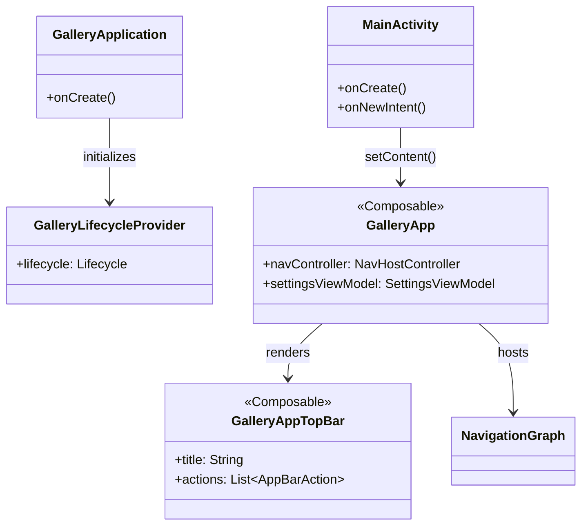
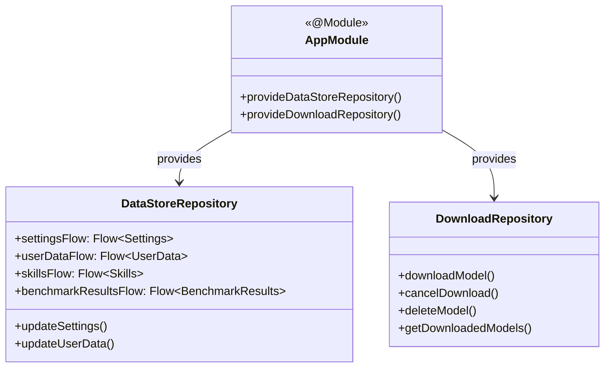
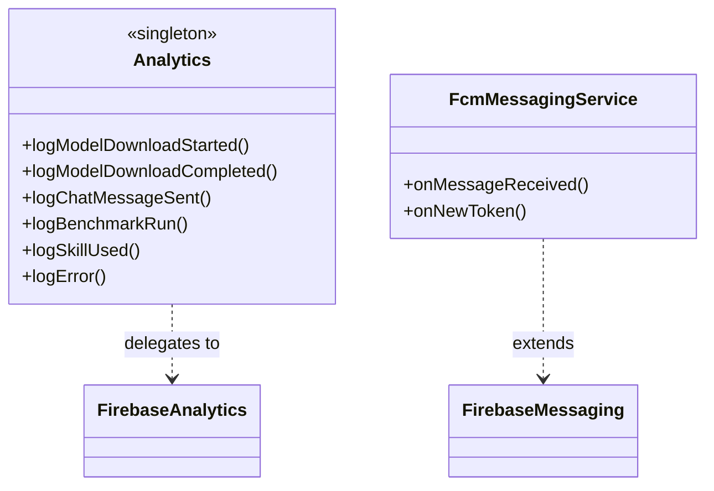

# L4 Architecture — Code-Level Overview

> **C4 Model Level 4:** This document provides a code-level view of the entire application, showing the principal classes, their responsibilities, and how they interact.

---

## Application Bootstrap



**Responsibilities:**

| Class | Responsibility |
|-------|---------------|
| `GalleryApplication` | Hilt entry point; initializes global singletons |
| `GalleryLifecycleProvider` | Provides `ProcessLifecycleOwner` to non-Activity components |
| `MainActivity` | Single Activity entry point; handles deep-link intents |
| `GalleryApp` | Root Composable; owns top-level NavController and SettingsViewModel |
| `GalleryAppTopBar` | Reusable top app bar; driven by `AppBarAction` list |

---

## Layer Diagram

```
┌─────────────────────────────────────────────────────────────────────┐
│  PRESENTATION LAYER  (ui/)                                           │
│   HomeScreen · LlmChatScreen · LlmSingleTurnScreen                  │
│   ModelManagerScreen · BenchmarkScreen                              │
│   ViewModels (HomeViewModel, LlmChatViewModel, SettingsViewModel…)  │
├─────────────────────────────────────────────────────────────────────┤
│  CUSTOM TASKS LAYER  (customtasks/)                                  │
│   AgentChatTask · MobileActionsTask · TinyGardenTask                │
│   ExampleCustomTask                                                  │
├─────────────────────────────────────────────────────────────────────┤
│  DOMAIN / DATA LAYER  (data/)                                        │
│   Model · Tasks · Categories · Config · Consts                      │
│   DataStoreRepository · DownloadRepository                          │
│   ModelAllowlist · SkillAllowlist                                   │
├─────────────────────────────────────────────────────────────────────┤
│  RUNTIME LAYER  (runtime/)                                           │
│   LlmModelHelper · ModelHelperExt                                   │
│   AiCoreManager (runtime/aicore/)                                   │
│   DownloadWorker (worker/)                                           │
├─────────────────────────────────────────────────────────────────────┤
│  SKILLS LAYER  (assets/skills/ + skills/)                            │
│   Built-in Skills (JS / Intent / System Prompt)                     │
│   Featured Skills (URL-hosted or local HTML/JS)                     │
├─────────────────────────────────────────────────────────────────────┤
│  INFRASTRUCTURE                                                      │
│   Hilt DI (di/) · Proto DataStore · Firebase Analytics/FCM          │
└─────────────────────────────────────────────────────────────────────┘
```

---

## Cross-Cutting Components

### Dependency Injection (Hilt)

All major dependencies are provided through `di/` modules:



### Analytics



---

## Data Flow: Model Inference

```
User Input (Compose TextField)
        │
        ▼
ViewModel (e.g. LlmChatViewModel)
        │ calls
        ▼
LlmModelHelper.generateResponse(prompt, images?)
        │ delegates to
        ▼
MediaPipe LLM Inference API (LiteRT)
        │ streams tokens
        ▼
ViewModel.uiState (StateFlow)
        │ collected by
        ▼
LlmChatScreen (Composable) — renders streamed tokens
```

---

## Data Flow: Skill Execution

```
LLM emits tool call JSON  →  ViewModel detects run_js / run_intent
        │
        ├── run_js  ──► WebView.evaluateJavascript(index.html)
        │                       │
        │                       ▼
        │              ai_edge_gallery_get_result(data)
        │                       │
        │                       ▼
        │              JS returns { result | webview | image | error }
        │                       │
        │                       ▼
        │              ViewModel renders result in chat
        │
        └── run_intent ──► Android Intent (send_email, etc.)
                               │
                               ▼
                          OS handles intent
```

---

## Proto DataStore Schema

All persistent data is stored using Protocol Buffers via Jetpack DataStore:

| Store File | Proto Message | Content |
|-----------|--------------|---------|
| `settings.pb` | `Settings` | Theme, text history, imported models, feature flags, ToS |
| `user_data.pb` | `UserData` | OAuth tokens, skill secrets (API keys) |
| `skills.pb` | `Skills` | List of installed skills with metadata |
| `benchmark_results.pb` | `BenchmarkResults` | Historical benchmark runs |
| `cutouts.pb` | *(display cutouts)* | Device display cutout info |

---

## Key Interfaces and Contracts

### Skill JavaScript Contract

Every JavaScript skill must implement this window function:

```typescript
window['ai_edge_gallery_get_result'] = async (data: string) => Promise<string>
// data   : JSON string with parameters defined in SKILL.md
// returns: JSON string with one of:
//   { result: any }                            — plain data result
//   { webview: { iframe: bool, url: string } } — embed a URL in WebView
//   { image: string }                          — base64 image
//   { error: string }                          — error message
```

### LLM Tool Call Contract

The LLM agent communicates with skills using a JSON tool-call protocol:

```json
{
  "tool": "run_js",
  "skill": "calculate-hash",
  "params": { "text": "hello world" }
}
```

or for native intents:

```json
{
  "tool": "run_intent",
  "intent": "send_email",
  "params": {
    "extra_email": "user@example.com",
    "extra_subject": "Subject",
    "extra_text": "Body"
  }
}
```

---

## Complete File → Class Map

| File Path (relative to `java/…/gallery/`) | Principal Class / Object |
|------------------------------------------|--------------------------|
| `GalleryApplication.kt` | `GalleryApplication : Application()` |
| `GalleryLifecycleProvider.kt` | `GalleryLifecycleProvider` |
| `MainActivity.kt` | `MainActivity : ComponentActivity()` |
| `GalleryApp.kt` | `GalleryApp` (Composable) |
| `GalleryAppTopBar.kt` | `GalleryAppTopBar` (Composable) |
| `Analytics.kt` | `Analytics` (object/singleton) |
| `FcmMessagingService.kt` | `FcmMessagingService : FirebaseMessagingService()` |
| `SettingsSerializer.kt` | `SettingsSerializer : Serializer<Settings>` |
| `SkillsSerializer.kt` | `SkillsSerializer : Serializer<Skills>` |
| `UserDataSerializer.kt` | `UserDataSerializer : Serializer<UserData>` |
| `BenchmarkResultsSerializer.kt` | `BenchmarkResultsSerializer : Serializer<BenchmarkResults>` |
| `CutoutsSerializer.kt` | `CutoutsSerializer : Serializer<…>` |
| `common/ProjectConfig.kt` | `ProjectConfig` (OAuth config constants) |
| `common/Types.kt` | Common type aliases |
| `common/Utils.kt` | `Utils` (utility functions) |
| `data/Model.kt` | `Model`, `LlmModelConfig`, `ModelState` |
| `data/Tasks.kt` | `Task`, task registry |
| `data/Categories.kt` | `Category` enum/data |
| `data/Config.kt` | `Config` (app-wide configuration) |
| `data/Consts.kt` | `Consts` (string/numeric constants) |
| `data/DataStoreRepository.kt` | `DataStoreRepository` |
| `data/DownloadRepository.kt` | `DownloadRepository` |
| `data/ModelAllowlist.kt` | `ModelAllowlist`, `AllowlistedModel` |
| `data/SkillAllowlist.kt` | `SkillAllowlist`, `AllowlistedSkill` |
| `data/Types.kt` | `DownloadStatus`, `TaskType`, etc. |
| `runtime/LlmModelHelper.kt` | `LlmModelHelper` |
| `runtime/ModelHelperExt.kt` | Extension functions on model helpers |
| `runtime/aicore/` | `AiCoreManager`, AI Core SDK wrappers |
| `worker/` | `DownloadWorker : CoroutineWorker()` |
| `customtasks/agentchat/` | `AgentChatTask`, `AgentChatViewModel` |
| `customtasks/mobileactions/` | `MobileActionsTask`, `MobileActionsViewModel`, `MobileActionsTools`, `Actions` |
| `customtasks/tinygarden/` | `TinyGardenTask`, `TinyGardenViewModel` |
| `customtasks/examplecustomtask/` | Reference implementation |
| `ui/home/` | `HomeScreen`, `HomeViewModel` |
| `ui/llmchat/` | `LlmChatScreen`, `LlmChatViewModel` |
| `ui/llmsingleturn/` | `LlmSingleTurnScreen`, `LlmSingleTurnViewModel` |
| `ui/modelmanager/` | `ModelManagerScreen`, `ModelManagerViewModel` |
| `ui/benchmark/` | `BenchmarkScreen`, `BenchmarkViewModel` |
| `ui/navigation/` | `NavigationGraph`, `Screen` (routes) |
| `ui/theme/` | `GalleryTheme`, `Color`, `Typography` |
| `ui/common/` | Shared Composable components |
| `ui/icon/` | Custom icon utilities |
| `di/` | Hilt `@Module` classes |
