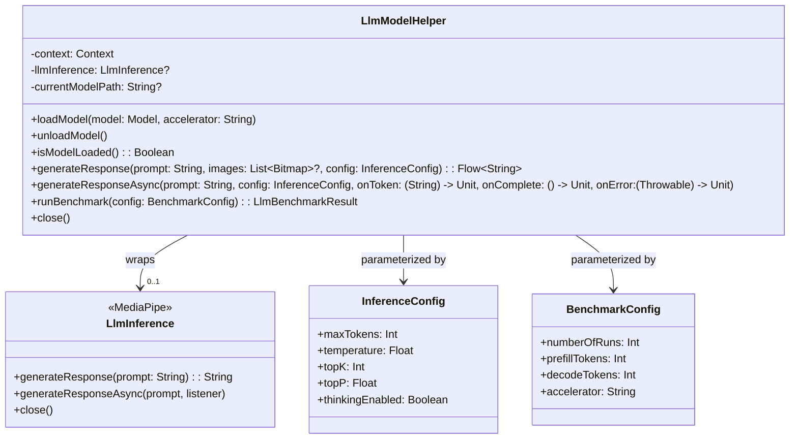
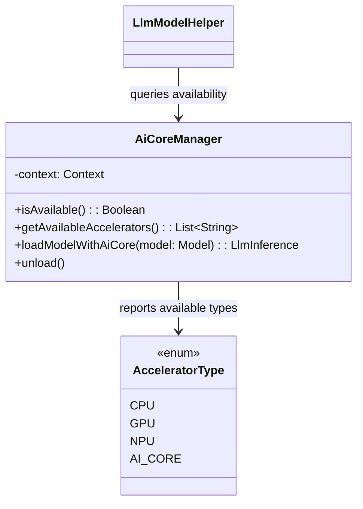
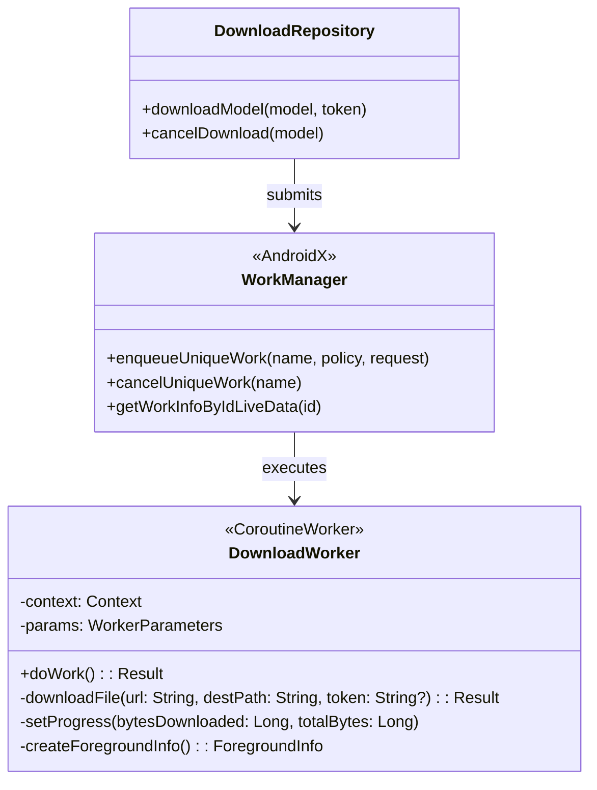

# L4 Architecture — Runtime Layer

> **C4 Model Level 4 — Runtime Layer:** LLM inference engine, AI Core integration, and background workers.

---

## Overview

The runtime layer bridges the Kotlin application code and the on-device machine learning inference engines. It abstracts the complexity of model loading, session management, token streaming, and background downloading behind clean, coroutine-friendly interfaces.

```
runtime/
├── LlmModelHelper.kt      ← Central LLM inference facade
├── ModelHelperExt.kt      ← Extension utilities (formatting, prompt building)
└── aicore/
    ├── AiCoreManager.kt   ← Google AI Core SDK integration
    └── (support classes)

worker/
└── DownloadWorker.kt      ← WorkManager-based model download
```

---

## LlmModelHelper

The primary class that the UI/ViewModel layer interacts with for all inference operations.



### Model Loading Sequence

```
ViewModel.loadModel(model)
    │
    ▼
LlmModelHelper.loadModel(model, accelerator)
    │
    ├── Resolve model file path from DownloadRepository
    │
    ├── Build LlmInference.Options:
    │     modelPath, accelerator, maxTokens, topK, topP, temperature
    │
    └── LlmInference.createFromOptions(context, options)
              │
              ▼
         LiteRT engine initializes model on GPU/CPU/NPU
```

### Token Streaming Flow

```
LlmModelHelper.generateResponse(prompt, images, config)
    │
    ├── (optional) encode images to base64 tokens
    │
    ├── build formatted prompt string (ModelHelperExt)
    │
    └── LlmInference.generateResponseAsync(
              prompt,
              partialResultListener = { partial, done ->
                  emit(partial)        // Flow<String>
                  if (done) close()
              }
          )
```

---

## ModelHelperExt

Extension functions that handle prompt formatting and result post-processing:

| Function | Purpose |
|----------|---------|
| `buildChatPrompt(history, systemPrompt)` | Formats chat history into model-specific prompt template |
| `extractThinkingBlocks(response)` | Separates `<think>` sections from final answer |
| `formatBenchmarkResult(result)` | Human-readable benchmark summary |
| `estimateTokenCount(text)` | Rough character-to-token estimate for UI hints |
| `resolveAccelerator(model)` | Picks best available accelerator (GPU → NPU → CPU) |

---

## AI Core Integration

Google AI Core is an optional runtime acceleration layer available on select Android devices (Pixel 8+, some Samsung, etc.).



### Accelerator Selection Logic

```
resolveAccelerator(model):
    if AiCoreManager.isAvailable()
        AND model.compatibleAccelerators contains "AI_CORE"
        → use AI_CORE
    else if GPU is available
        → use GPU
    else
        → use CPU
```

---

## Background Workers

### DownloadWorker

Runs model file downloads in the background via WorkManager, survives process death, and reports progress.



#### WorkManager Input Data Keys

| Key | Type | Description |
|-----|------|-------------|
| `KEY_MODEL_URL` | String | Remote URL to download |
| `KEY_MODEL_NAME` | String | Unique model identifier |
| `KEY_DEST_PATH` | String | Local file path destination |
| `KEY_ACCESS_TOKEN` | String? | Bearer token for gated models |

#### Progress Reporting

```kotlin
// Worker reports progress via setProgress():
setProgress(workDataOf(
    KEY_BYTES_DOWNLOADED to bytesDownloaded,
    KEY_TOTAL_BYTES to totalBytes
))

// DownloadRepository observes via WorkInfo:
workManager.getWorkInfoByIdLiveData(workId)
    .map { workInfo ->
        when (workInfo.state) {
            RUNNING   -> InProgress(workInfo.progress)
            SUCCEEDED -> Succeeded
            FAILED    -> Failed(workInfo.outputData.getString(KEY_ERROR))
            CANCELLED -> Cancelled
            else      -> Idle
        }
    }
```

#### Download Error Handling

| Scenario | Behaviour |
|----------|-----------|
| HTTP 401 Unauthorized | Surfaces sign-in prompt in Model Manager |
| HTTP 404 Not Found | `Failed` state with descriptive message |
| Network timeout | WorkManager retries with exponential backoff |
| Insufficient storage | `Failed` state with storage error |
| User cancels | `Cancelled` state; partial file deleted |

---

## Foreground Service for Downloads

Large model downloads (up to 4+ GB) use a `FOREGROUND_SERVICE` to ensure continuity:

```xml
<!-- AndroidManifest.xml -->
<uses-permission android:name="android.permission.FOREGROUND_SERVICE" />
<uses-permission android:name="android.permission.FOREGROUND_SERVICE_DATA_SYNC" />

<service
    android:name="androidx.work.impl.foreground.SystemForegroundService"
    android:foregroundServiceType="dataSync" />
```

The `DownloadWorker.createForegroundInfo()` builds a persistent notification showing progress and a cancel action.

---

## LiteRT (MediaPipe) Integration Details

```
Dependency:   com.google.ai.edge.litertlm:litertlm:<version>
Model format: .task (TensorFlow Lite task bundle)
API entry:    com.google.mediapipe.tasks.genai.llminference.LlmInference
```

### Supported Accelerators per Model

Each model in `model_allowlist.json` specifies `compatibleAccelerators`:

```json
"compatibleAccelerators": ["GPU", "CPU"]
```

| Accelerator | Notes |
|-------------|-------|
| `CPU` | Universal fallback; slower |
| `GPU` | Default on most Android devices; requires OpenCL |
| `NPU` | Device-specific (Pixel 8+, Snapdragon 8 Gen 3+) |

### Inference Parameters

| Parameter | Default | Range | Description |
|-----------|---------|-------|-------------|
| `maxTokens` | model-specific | 256–8192 | Max output length |
| `temperature` | 1.0 | 0.0–2.0 | Sampling randomness |
| `topK` | 40 | 1–100 | Top-K sampling |
| `topP` | 1.0 | 0.0–1.0 | Nucleus sampling |

---

## Runtime Lifecycle

```
App starts
    └── GalleryApplication.onCreate()
            └── Hilt component graph built

User selects task + model
    └── ModelManagerViewModel.onModelSelected()
            └── LlmModelHelper.loadModel(model, accelerator)
                    └── LiteRT engine initializes (blocking, ~2–10 sec)

User sends message
    └── LlmChatViewModel.sendMessage(text, images)
            └── LlmModelHelper.generateResponse(prompt, images, config)
                    └── tokens stream via Flow<String>

User navigates away or app goes to background
    └── ViewModel.onCleared()
            └── LlmModelHelper.close()
                    └── LiteRT engine released, GPU memory freed
```

> **Important:** The LLM engine holds significant GPU/CPU memory (2–8 GB). It is released only when the ViewModel is cleared (back-stack pop or process death). The app does not run multiple models concurrently.
