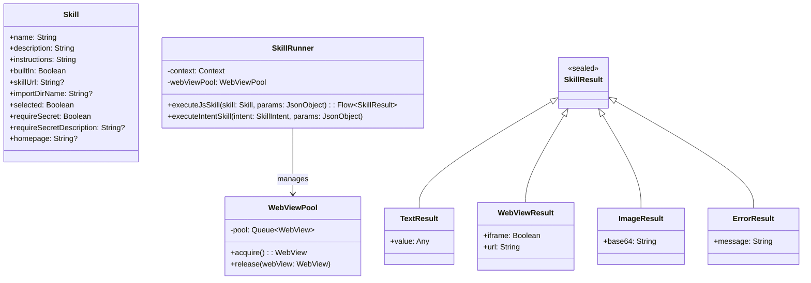
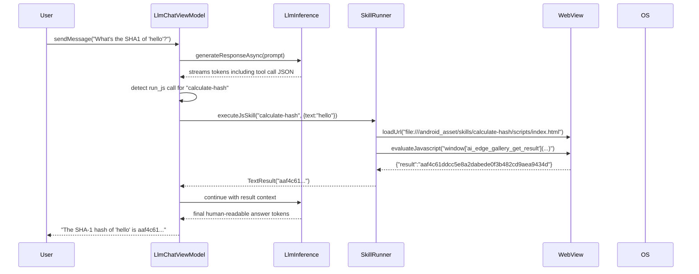

# L4 Architecture — Skills System

> **C4 Model Level 4 — Skills System:** Agent Skills architecture, JavaScript runtime, native intents, and the skill lifecycle.

---

## Overview

Agent Skills extend the LLM's capabilities by giving it callable "tools". When the model decides a skill is relevant to the user's request, it emits a structured JSON tool-call that the app intercepts and executes — then feeds the result back into the conversation.

```
skills/
├── built-in/               ← Shipped with the app
│   ├── calculate-hash/
│   ├── interactive-map/
│   ├── kitchen-adventure/
│   ├── mood-tracker/
│   ├── qr-code/
│   ├── query-wikipedia/
│   ├── send-email/
│   └── text-spinner/
└── featured/               ← Community-contributed
    ├── mood-music/
    ├── restaurant-roulette/
    └── virtual-piano/

Android/src/app/src/main/assets/skills/
    └── (built-in skill files bundled into the APK)
```

---

## Skill Types

| Type | Execution Mechanism | Example |
|------|-------------------|---------|
| **Text-Only** | Skill text injected into system prompt | `kitchen-adventure` |
| **JavaScript** | HTML WebView + `run_js` tool call | `calculate-hash`, `mood-tracker` |
| **Native Intent** | Android Intent + `run_intent` tool call | `send-email` |

---

## Skill Class Diagram



---

## Skill File Structure

Every skill is a directory following this layout:

```
skill-name/
├── SKILL.md              ← Metadata + LLM instructions (required)
└── scripts/
    └── index.html        ← JS logic entry point (required for JS skills)
        index.js          ← Optional external JS (loaded by index.html)
    assets/
        webview.html      ← Optional persistent UI shown in chat
        dashboard.html    ← Optional secondary view (mood-tracker)
```

### SKILL.md Format

```yaml
---
name: skill-name
description: One-line description for model to decide relevance
---

# Skill Title

## Instructions

Full natural-language instructions explaining to the LLM:
- What the skill does
- When to invoke it
- What parameters to pass
- How to interpret results

## Tool Definitions (if applicable)

### run_js
Input JSON schema: { param1: type, param2: type }

### run_intent
Intent: intent_name
Parameters: { key: value }
```

---

## JavaScript Skill Contract

### Entry Point

The `index.html` is loaded into a headless `WebView`. It must register this global function before any tool call:

```javascript
window['ai_edge_gallery_get_result'] = async (data) => {
  // data: JSON string with params from LLM
  const params = JSON.parse(data);

  // ... execute skill logic ...

  return JSON.stringify(result);
};
```

### Result Schema

The function must return a JSON string conforming to one of these shapes:

```typescript
// Success — plain data
{ "result": any }

// Success — embed a URL in a WebView panel
{ "webview": { "iframe": boolean, "url": string } }

// Success — display an image
{ "image": "data:image/png;base64,..." }

// Failure
{ "error": "Human-readable error message" }
```

### App ↔ WebView Communication

```
LLM emits tool call
      │
      ▼
ViewModel detects "run_js" in model output
      │
      ▼
WebView.evaluateJavascript(
    "window['ai_edge_gallery_get_result']('" + escapedParams + "')",
    callback = { jsonResult ->
        parseSkillResult(jsonResult)
    }
)
      │
      ▼
JS function executes (may call fetch(), crypto, localStorage, etc.)
      │
      ▼
Callback receives JSON result string
      │
      ▼
ViewModel inserts result into chat history
```

---

## Native Intent Skill Contract

Skills that use device OS capabilities use the `run_intent` tool:

```json
{
  "tool": "run_intent",
  "intent": "send_email",
  "params": {
    "extra_email": "recipient@example.com",
    "extra_subject": "Hello",
    "extra_text": "Body of the email"
  }
}
```

### Supported Intents

| Intent Name | Android Action | Parameters |
|-------------|---------------|-----------|
| `send_email` | `Intent.ACTION_SENDTO` | `extra_email`, `extra_subject`, `extra_text` |

---

## Skill Lifecycle



---

## Built-in Skills Reference

### calculate-hash
- **Tool:** `run_js`
- **Input:** `{ text: string }`
- **Output:** `{ result: string }` — hex SHA-1 hash
- **Implementation:** Web Crypto API (`crypto.subtle.digest('SHA-1', ...)`)

### query-wikipedia
- **Tool:** `run_js`
- **Input:** `{ topic: string, lang: string }`
- **Output:** `{ result: string }` — 1–3 sentence summary
- **Implementation:** Calls Wikipedia REST API (`/api/rest_v1/page/summary/{topic}`)

### send-email
- **Tool:** `run_intent`
- **Intent:** `send_email`
- **Params:** `extra_email`, `extra_subject`, `extra_text`
- **Output:** Opens device mail app; no result returned to LLM

### mood-tracker
- **Tool:** `run_js`
- **Actions:** `log_mood`, `get_mood`, `get_history`, `plot_mood`, `analyze_trends`, `delete_mood`, `export_data`, `wipe_data`
- **Storage:** `localStorage` in the WebView (persisted per-device)
- **Dashboard:** Loads `assets/dashboard.html` as a WebView panel

### text-spinner
- **Tool:** `run_js`
- **Input:** `{ label: string }`
- **Output:** `{ webview: { ... } }` — animated text spinner UI

### interactive-map
- **Tool:** `run_js`
- **Input:** `{ location: string }`
- **Output:** `{ webview: { iframe: true, url: "https://maps.google.com/..." } }`

### kitchen-adventure
- **Type:** Text-Only
- **Mechanism:** SKILL.md instructions injected into system prompt
- **No tool calls** — the LLM itself acts as a dungeon master

### qr-code
- **Tool:** `run_js`
- **Input:** `{ url: string }`
- **Output:** `{ image: "data:image/png;base64,..." }` — generated QR code

---

## Featured Skills Reference

### mood-music
- **Requires:** Loudly API key (stored in `UserData.secrets`)
- **Step 1:** Fetch available genres (`GET /api/v1/genres`)
- **Step 2:** Map mood → genre → generate track (`POST /api/v1/generate`)
- **Output:** Embedded audio player webview
- **Parameters:** `genre`, `genre_blend`, `duration (30–420s)`, `energy`, `bpm`

### restaurant-roulette
- **Requires:** Google Maps Places API key
- **Input:** `{ location: string, cuisine: string }`
- **Output:** Spin-wheel WebView with up to 10 restaurants
- **Flow:** JS calls Places API → populates wheel → user taps to spin

### virtual-piano
- **Type:** WebView UI (no API key needed)
- **Output:** Horizontally-scrolling piano with Web Audio synthesis
- **Trigger phrases:** "Open virtual piano", "Play piano", "Show keyboard"

---

## Adding a New Skill

### 1. Create the skill directory

```
skills/built-in/my-skill/
├── SKILL.md
└── scripts/
    └── index.html
```

### 2. Write SKILL.md

```yaml
---
name: my-skill
description: Short one-line description used by the LLM
---

# My Skill

## Instructions

Describe what the skill does and when to use it.

## Tool

### run_js
Input: { param1: string, param2: number }
```

### 3. Implement index.html

```html
<!DOCTYPE html>
<html>
<body>
<script>
window['ai_edge_gallery_get_result'] = async (data) => {
  const { param1, param2 } = JSON.parse(data);
  try {
    const result = doSomething(param1, param2);
    return JSON.stringify({ result });
  } catch (e) {
    return JSON.stringify({ error: e.message });
  }
};
</script>
</body>
</html>
```

### 4. Bundle into the app

Copy your skill directory into:
```
Android/src/app/src/main/assets/skills/my-skill/
```

### 5. Register in SkillAllowlist

Add an entry so the app discovers and loads your skill on startup.

### 6. (Optional) Add a secret

If your skill requires an API key, set `requireSecret: true` and `requireSecretDescription` in SKILL.md. The app will prompt the user for the key, which is stored in `UserData.secrets`.

---

## Security Considerations

| Concern | Mitigation |
|---------|-----------|
| XSS in WebView | Skills run in isolated WebViews; no JavaScript bridge to the main app |
| Data exfiltration | Built-in skills use only bundled JS; network access is intentional per skill |
| API key storage | Keys stored in `UserData` proto (app-private DataStore, not shared preferences) |
| Remote skills | Loaded from user-provided URL; user must explicitly import and trust |
| LocalStorage | Scoped to the skill's WebView origin; skills cannot access each other's data |
