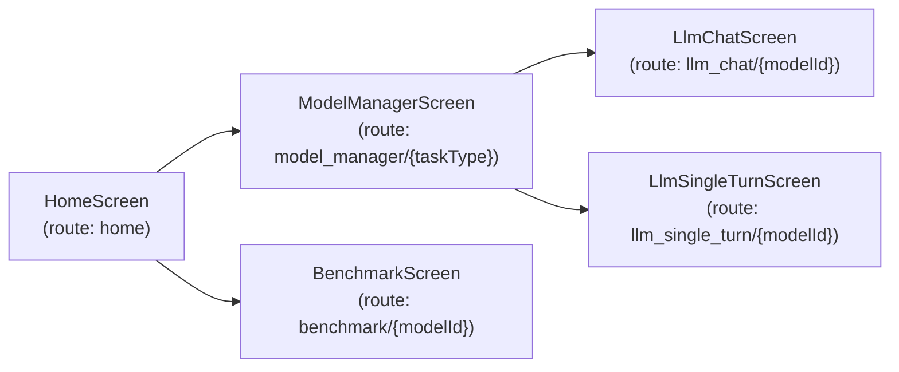
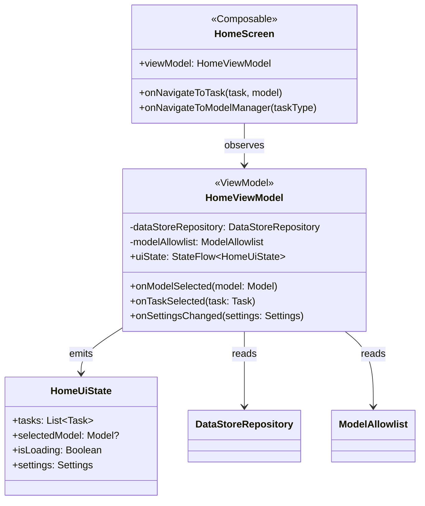
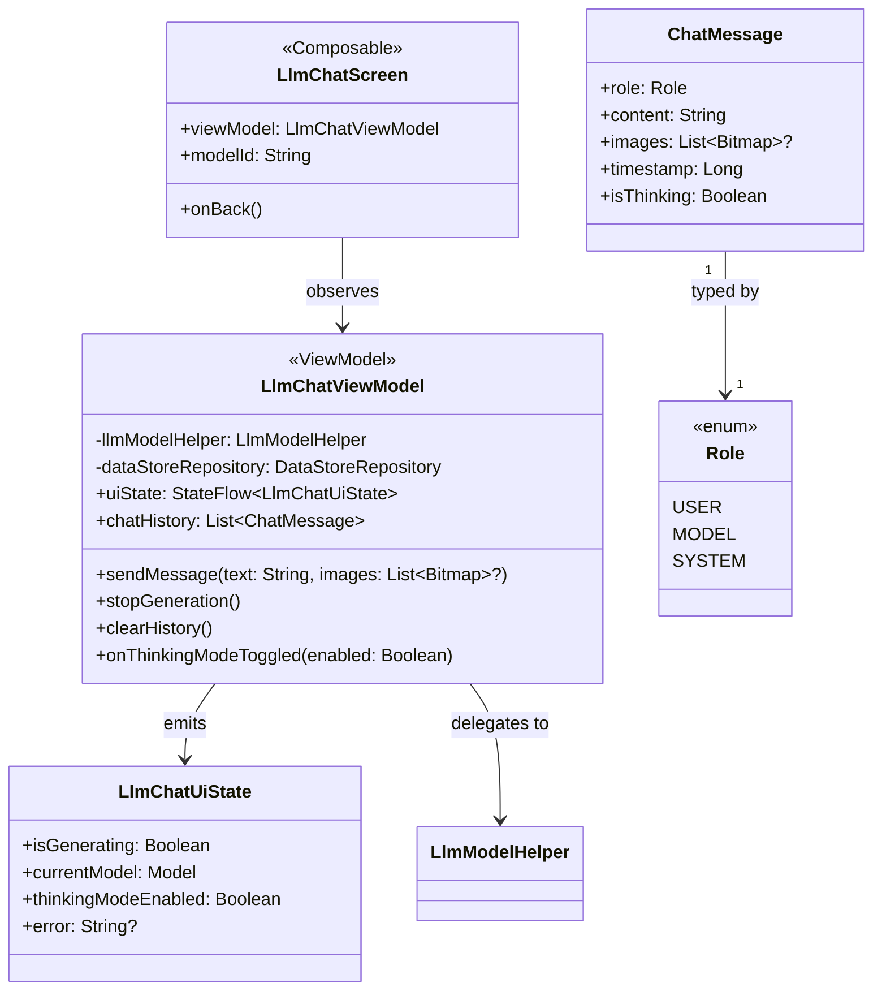
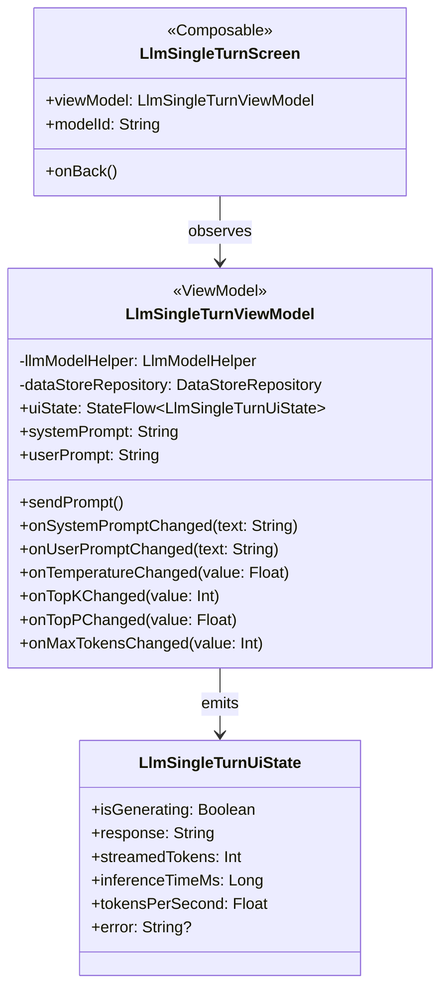
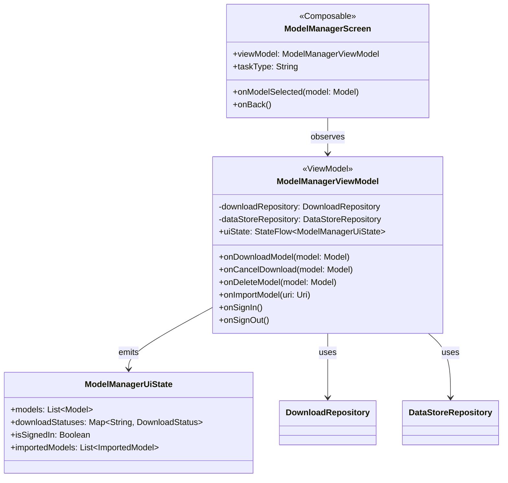
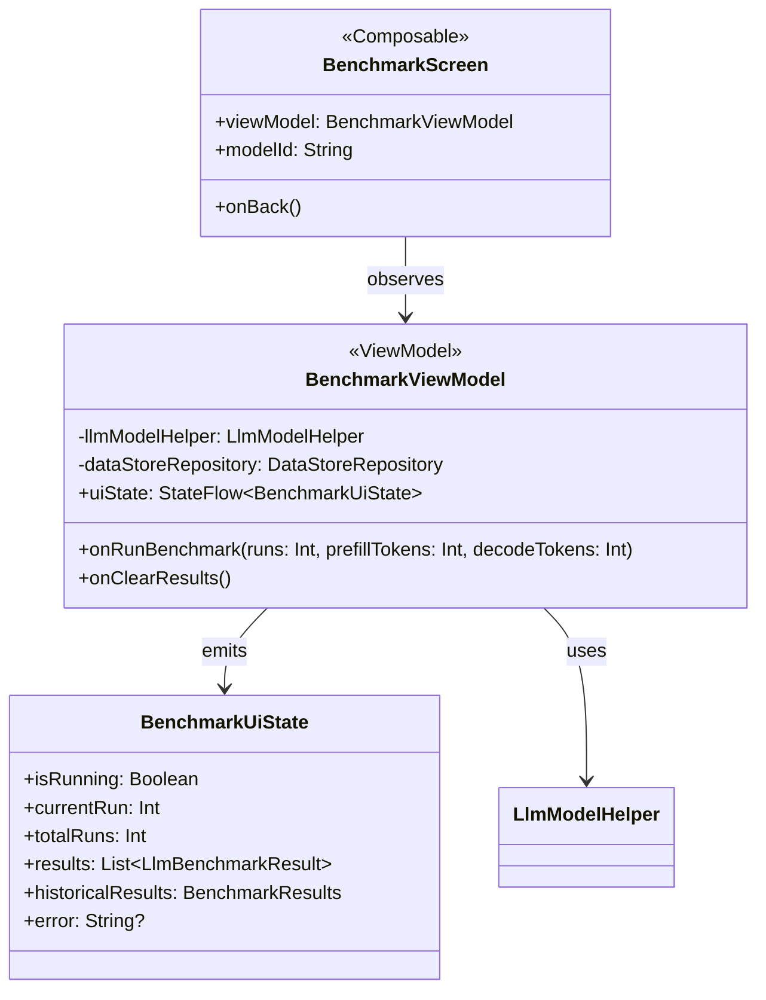
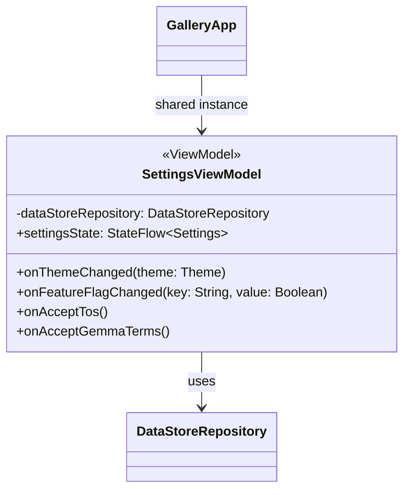
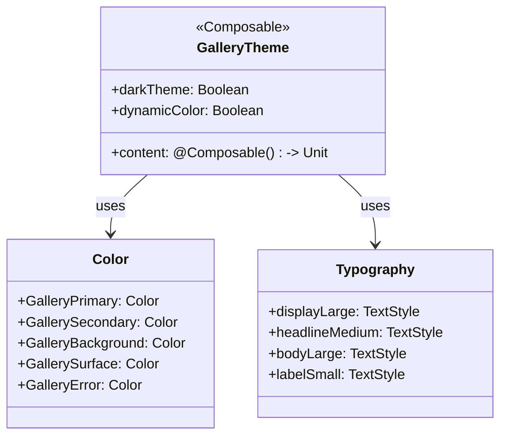

# L4 Architecture — UI Layer

> **C4 Model Level 4 — UI Layer:** Jetpack Compose screens, ViewModels, and the navigation graph.

---

## Overview

The UI layer follows the **MVVM (Model-View-ViewModel)** pattern using Jetpack Compose for the view layer and `StateFlow`/`collectAsStateWithLifecycle` for reactive state management.

```
ui/
├── navigation/     ← NavHost and Screen sealed class (route definitions)
├── home/           ← Task/model selection hub
├── llmchat/        ← Multi-turn LLM chat interface
├── llmsingleturn/  ← Prompt Lab (single-turn inference)
├── modelmanager/   ← Download, import, and manage models
├── benchmark/      ← Performance benchmarking
├── common/         ← Shared composables (buttons, loaders, markdown…)
├── icon/           ← Custom icon helpers
└── theme/          ← GalleryTheme, Color, Typography
```

---

## Navigation Graph



### Screen Routes

| Screen Composable | Route String | Key Arguments |
|------------------|--------------|---------------|
| `HomeScreen` | `home` | — |
| `ModelManagerScreen` | `model_manager/{taskType}` | `taskType: String` |
| `LlmChatScreen` | `llm_chat/{modelId}` | `modelId: String` |
| `LlmSingleTurnScreen` | `llm_single_turn/{modelId}` | `modelId: String` |
| `BenchmarkScreen` | `benchmark/{modelId}` | `modelId: String` |

---

## Home Screen



**HomeScreen responsibilities:**
- Display categorized task tiles (AI Chat, Prompt Lab, Ask Image, etc.)
- Show model download state badges on each task
- Entry point for navigating to Model Manager or directly into a task

---

## LLM Chat Screen



**LlmChatScreen responsibilities:**
- Multi-turn conversational interface with streaming token rendering
- Image attachment support (camera or gallery)
- Thinking Mode toggle (shows model's reasoning chain)
- Markdown rendering of model responses
- Agent Skill results display (WebView, images, plain text)

---

## LLM Single-Turn Screen (Prompt Lab)



**LlmSingleTurnScreen responsibilities:**
- Editable system prompt + user prompt fields
- Inference parameter controls (temperature, top-k, top-p, max tokens)
- Real-time performance metrics display (tokens/sec, latency)

---

## Model Manager Screen



**ModelManagerScreen responsibilities:**
- List allowlisted models with size and peak-memory info
- Show download progress bars
- Handle Hugging Face OAuth sign-in (gated models)
- Support importing local `.task` files

---

## Benchmark Screen



**BenchmarkScreen responsibilities:**
- Configurable benchmark runs (number of runs, prompt lengths)
- Displays per-run and aggregated statistics (prefill/decode speed, TTFT)
- Historical comparison charts across model versions

---

## Settings ViewModel (Global)



`SettingsViewModel` is scoped to the Activity and shared across all screens for global settings like theme, feature flags, and terms acceptance.

---

## Theme System



- Supports Light, Dark, and System-Auto themes
- Dynamic color on Android 12+ (Material You)
- Stored in `Settings.theme` proto field; applied at `GalleryApp` level

---

## Common Shared Composables

| Composable | Purpose |
|-----------|---------|
| `LoadingIndicator` | Spinner for async operations |
| `ErrorBanner` | Dismissable error card |
| `MarkdownText` | Renders CommonMark markdown in chat |
| `ImageAttachmentRow` | Horizontal scrollable image thumbnails |
| `ConfirmDialog` | Generic confirm/cancel dialog |
| `DownloadProgressBar` | Model download progress with cancel |
| `ModelInfoCard` | Displays model metadata (size, RAM, tasks) |
| `InferenceMetricsRow` | Shows tokens/sec, latency stats |

---

## State Management Pattern

All screens follow this reactive pattern:

```kotlin
// In ViewModel:
private val _uiState = MutableStateFlow(InitialUiState())
val uiState: StateFlow<UiState> = _uiState.asStateFlow()

// In Composable:
val uiState by viewModel.uiState.collectAsStateWithLifecycle()
```

Side effects (navigation, toasts) are communicated via `SharedFlow`:

```kotlin
// In ViewModel:
private val _events = MutableSharedFlow<UiEvent>()
val events: SharedFlow<UiEvent> = _events.asSharedFlow()

// In Composable:
LaunchedEffect(Unit) {
    viewModel.events.collect { event ->
        when (event) {
            is UiEvent.NavigateTo -> navController.navigate(event.route)
            is UiEvent.ShowToast -> Toast.makeText(context, event.msg, Toast.LENGTH_SHORT).show()
        }
    }
}
```
